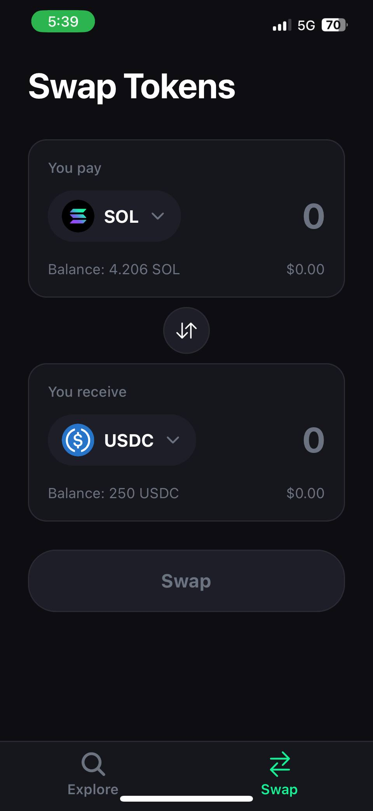
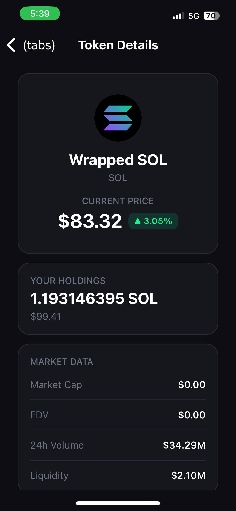

# 0xSol App

A minimal React Native + Solana Web3 mobile app — built in public.

> Learn → Build → Ship → Repeat

---

## About

0xSol is a mobile app for exploring Solana wallets — starting simple and growing one feature at a time.

The goal isn't to build the next big thing overnight. It's to learn by doing, ship working code consistently, and document the process publicly.

---

## Why This Project

Most Web3 tutorials are either too shallow or too complex. This is a ground-up build — starting from zero, adding real Solana functionality step by step, and sharing everything along the way.

---

## Build in Public Log

| Day | Topic                                              | Notes                            | Preview |
| --- | -------------------------------------------------- | -------------------------------- | ------- |
| 01  | Project setup + Basic UI                           | [docs/day-01.md](docs/day-01.md) | —       |
| 02  | Navigation, Swap UI, Token Details + DexScreener   | [docs/day-02.md](docs/day-02.md) |   |
| 03  | Settings tab, Favorites, Search History & Devnet   | [docs/day-03.md](docs/day-03.md) |   |
| 04  | Android native build & physical device setup        | [docs/day-04.md](docs/day-04.md) | —       |

---

## Tech Stack

| Layer      | Technology                     |
| ---------- | ------------------------------ |
| Framework  | React Native (Expo)            |
| Language   | TypeScript                     |
| State      | Zustand                        |
| Blockchain | Solana Web3.js                 |
| Navigation | Expo Router                    |

---

## Architecture

```
UI → Input → Service Layer (RPC) → Data Processing → UI Rendering
```

Simple, layered, and easy to extend.

---

## Current Features

- Enter a Solana wallet address to view balance, tokens, and transactions
- Tap any token to open a live Token Details page (price, market cap, holdings) via DexScreener
- Swap screen with token picker, amount input, and flip button
- Bottom tab navigation (Explore, Swap, Settings)
- Save wallets to favorites with a heart icon on the balance card
- Search history — auto-populated, tap any entry to re-search
- Devnet toggle — switch between mainnet and devnet in one tap
- All preferences persisted across app restarts via AsyncStorage

---

## Getting Started

**Prerequisites:** Node.js, npm, and Expo CLI installed.

```bash
# Clone the repo
git clone https://github.com/ethicalhub/0xSolApp.git
cd 0xSolApp

# Install dependencies
npm install

# Start the development server
npx expo start
```

Then open the app in:

- **Expo Go** (scan the QR code)
- **Android emulator** — press `a`
- **iOS simulator** — press `i`

---

## Roadmap

- [x] Project setup
- [x] Basic UI with wallet input
- [x] Fetch wallet balance, tokens, and transactions via RPC
- [x] Bottom tab navigation
- [x] Token Details page with live DexScreener data
- [x] Swap UI with token picker
- [x] Settings tab with favorites, search history, and devnet toggle
- [x] AsyncStorage persistence for user preferences
- [x] Android native build with physical device support (custom dev client)
- [ ] Solana Mobile Wallet Adapter (MWA) integration
- [ ] Live token prices in Swap screen
- [ ] Transaction confirmation sheet
- [ ] Portfolio view

---

## Notes

- Mainnet RPC endpoint is configured via `SOL_RPC_URL` in `.env`
- Devnet RPC endpoint is configured via `SOL_DEVNET_RPC_URL` in `.env`
- This project uses Expo Router for file-based navigation
- State management is handled by Zustand (wallet-store, swap-store, settings-store)
- User preferences (favorites, history, network) are persisted via AsyncStorage

---

## Follow Along

This is a build-in-public project. Progress is documented in the [docs/](docs/) folder, one day at a time.

---

## Support

If you find this useful, a star on GitHub goes a long way.
