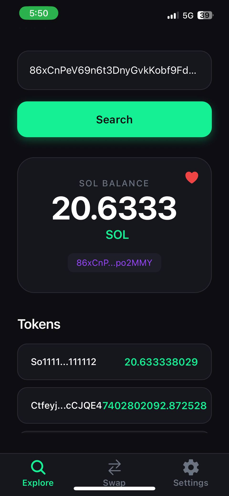
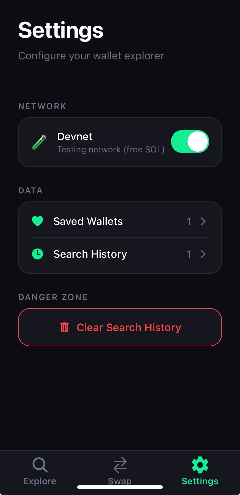

# Day 03 — Settings Tab, Favorites, Search History & Devnet Toggle

**Date:** 2026-04-02
**Project:** [0xSol App](../README.md)
**Status:** Done

---

## Preview

 

---

## Goal for the Day

Day 2 ended with a solid explorer and swap UI. Before adding more features, it made sense to give users a way to manage their experience — save wallets they check often, revisit past searches, and toggle between mainnet and devnet without touching any code.

The focus was user preferences: persistent, lightweight, and cleanly separated from the blockchain data layer.

---

## What We Built

### 1. Settings Tab

Added a third tab to the bottom navigator — **Settings** — with a `settings-sharp` icon.

The screen has three sections matching the screenshot:

| Section | Content |
|---------|---------|
| **NETWORK** | Devnet toggle — switch between mainnet and devnet |
| **DATA** | Saved Wallets (count + chevron) + Search History (count + chevron) |
| **DANGER ZONE** | Clear Search History button |

Navigation from the DATA rows goes to dedicated sub-screens with a back button.

---

### 2. `stores/settings-store.ts` — A Separate Store for User Preferences

The key architectural decision of Day 3: **don't put user preferences in `wallet-store.ts`**.

`wallet-store` has one job — fetch and hold blockchain data for a searched address. That data is ephemeral: every new search replaces it. Favorites and search history are the opposite — they accumulate over time and need to survive app restarts.

Different lifecycles mean different stores.

```
wallet-store.ts     → blockchain data, ephemeral, not persisted
settings-store.ts   → user preferences, persistent, lives in AsyncStorage
```

**State:**

```ts
favorites: string[]       // wallet addresses the user saved
searchHistory: string[]   // auto-populated on every successful search
isDevnet: boolean         // which RPC endpoint to hit
```

**Actions:**

```ts
addFavorite(address)      // prepend, no duplicates
removeFavorite(address)   // filter out
isFavorite(address)       // boolean check
addToHistory(address)     // prepend, dedupe, cap at 20 entries
clearHistory()            // wipe the list
toggleNetwork()           // flip isDevnet
```

The only coupling between the two stores is one line in `wallet-store`'s `search()` action:

```ts
useSettingsStore.getState().addToHistory(addr);
```

Called imperatively after a successful search — no hooks, no subscriptions, no tight coupling.

---

### 3. AsyncStorage Persistence — `lib/storage.ts`

User preferences are useless if they reset every time the app restarts. We added persistence using zustand's `persist` middleware backed by `@react-native-async-storage/async-storage`.

**Storage adapter (`lib/storage.ts`):**

```ts
export const asyncStorageAdapter = {
  getItem:    (key) => AsyncStorage.getItem(key),
  setItem:    (key, value) => AsyncStorage.setItem(key, value),
  removeItem: (key) => AsyncStorage.removeItem(key),
};
```

A thin wrapper that adapts AsyncStorage's API to what zustand's `createJSONStorage` expects. Keeping it in its own file means the store itself stays clean.

**Store wrapping (curried `create` syntax):**

```ts
export const useSettingsStore = create<SettingsState>()(
  persist(
    (set, get) => ({ ... }),
    {
      name: "settings-storage",
      storage: createJSONStorage(() => asyncStorageAdapter),
    },
  ),
);
```

The double-call `create<State>()()` is the correct pattern when using zustand middleware — the outer call creates the typed wrapper, the inner call receives the implementation.

**Hydration guard:**

AsyncStorage reads are async. On app start there's a brief moment where the store has default values before persisted data loads in. Without a guard, the Settings screen could flash `0` counts or show the wrong network toggle state.

```ts
useEffect(() => {
  const unsub = useSettingsStore.persist.onFinishHydration(() =>
    setHydrated(true),
  );
  if (useSettingsStore.persist.hasHydrated()) setHydrated(true);
  return unsub;
}, []);
```

The dual check handles both cases: data that's already loaded by render time (synchronous path) and data that loads after (async path). A spinner shows until hydration completes.

---

### 4. Heart Icon — Favorites from the Explore Screen

Saving a wallet happens from the **Explore tab**, not the Settings tab. After searching a wallet, a heart icon appears in the top-right corner of the BalanceCard.

- Outline heart (`heart-outline`) → not saved
- Filled red heart (`heart`) → saved
- Tapping toggles between `addFavorite` and `removeFavorite`

The icon uses a **zustand selector** rather than subscribing to the full `favorites` array:

```ts
const favorited = useSettingsStore((s) => s.favorites.includes(address));
```

This way the component only re-renders when `favorited` actually changes for this specific address — not on every favorites update.

---

### 5. Saved Wallets Screen (`app/settings/saved-wallets.tsx`)

A list of all saved addresses. Each row:
- Shows a shortened address (`short(address, 8)`)
- Tapping the row re-searches that wallet and navigates back to Explore
- An X button removes it from favorites

Empty state when the list is empty — with a message explaining how to add from Explore.

---

### 6. Search History Screen (`app/settings/history.tsx`)

Auto-populated. Every successful `search()` adds the address to history — no user action required.

- Capped at 20 entries
- Deduped on insert (re-searching an existing address moves it to the top, not appended)
- Tapping any row re-searches that wallet and navigates back to Explore
- "Clear Search History" on the Settings screen wipes it entirely

---

### 7. Devnet RPC Support

`isDevnet` isn't just a UI toggle — it changes which RPC endpoint every blockchain call hits. The flag is threaded through the entire service stack:

```
wallet-store.ts        reads isDevnet from useSettingsStore.getState()
  → services/solana.ts   getBalance(addr, isDevnet), getTokens(addr, isDevnet), getTxns(addr, isDevnet)
    → services/rpc.ts      picks MAINNET_URL or DEVNET_URL
```

Both URLs come from environment variables:

```env
SOL_RPC_URL=https://api.mainnet-beta.solana.com
SOL_DEVNET_RPC_URL=https://api.devnet.solana.com
```

Exposed via `app.config.ts` extra, read by `rpc.ts` at startup. Swap to a private RPC endpoint (Helius, QuickNode) by changing the `.env` value — nothing else needs to change.

---

## Architecture After Day 3

```
app/
  (tabs)/
    _layout.tsx         ← 3 tabs: Explore, Swap, Settings
    index.tsx           ← Explore screen
    swap.tsx            ← Swap screen
    settings.tsx        ← Settings screen (new)
  settings/
    saved-wallets.tsx   ← Favorites list (new)
    history.tsx         ← Search history list (new)
  token/
    [mint].tsx          ← Token Details screen

stores/
  wallet-store.ts       ← blockchain data (publicKey, balance, tokens, txns)
  swap-store.ts         ← swap screen state
  settings-store.ts     ← user preferences, persisted (new)

lib/
  storage.ts            ← AsyncStorage adapter for zustand persist (new)

services/
  rpc.ts                ← now accepts isDevnet, picks URL accordingly
  solana.ts             ← getBalance/getTokens/getTxns all accept isDevnet
  dexscreener.ts

components/
  explore/
    balance-card.tsx    ← heart icon for favorites (updated)
    ...
```

---

## Learnings

- **Separate stores for separate lifecycles.** The instinct to put everything in `wallet-store` was wrong. Settings and blockchain data change at different rates, for different reasons, and need different persistence strategies. One concern per store.
- **`create<State>()()` is the correct zustand middleware syntax.** The single-call form `create<State>(persist(...))` doesn't work with TypeScript's strict inference when middleware is involved. The curried double-call is the documented pattern.
- **Zustand `persist` only serializes plain data — not functions.** Actions are never stored. Only `favorites`, `searchHistory`, and `isDevnet` hit AsyncStorage. No configuration needed; zustand handles the filtering automatically.
- **Hydration is async — guard against it.** The dual `onFinishHydration` + `hasHydrated()` check is the correct pattern. Just `onFinishHydration` alone will miss the case where hydration already finished before the effect runs (possible on fast devices or repeat renders).
- **Zustand selectors prevent over-rendering.** Subscribing to the whole `favorites` array in `BalanceCard` would cause every component using `favorites` to re-render whenever any favorite is added or removed. A selector returning a derived boolean (`s.favorites.includes(address)`) re-renders only when the result for *this specific address* changes.
- **Imperative `getState()` for cross-store calls.** When `wallet-store` needs to call `addToHistory` from `settings-store`, using `useSettingsStore.getState()` (outside of React) is correct. Hooks can't be called inside zustand actions. `getState()` gives direct access to the store without subscribing.

---

## Summary

| What | How |
|------|-----|
| Settings tab | Third tab in `(tabs)/` with `settings-sharp` icon |
| User preferences store | `stores/settings-store.ts` — separate from `wallet-store` |
| AsyncStorage persistence | zustand `persist` middleware + `lib/storage.ts` adapter |
| Hydration guard | `onFinishHydration` + `hasHydrated()` on Settings screen |
| Favorites | Heart icon on `BalanceCard`, zustand selector for reactivity |
| Search history | Auto-added in `search()`, capped at 20, deduped |
| Devnet toggle | `isDevnet` threaded from store → `rpc.ts`, URLs from `.env` |

---

[← Day 02](day-02.md) | [Back to README](../README.md)
